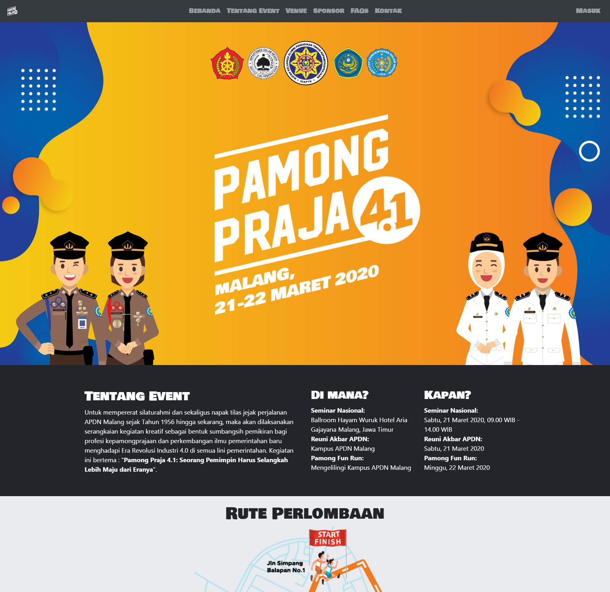
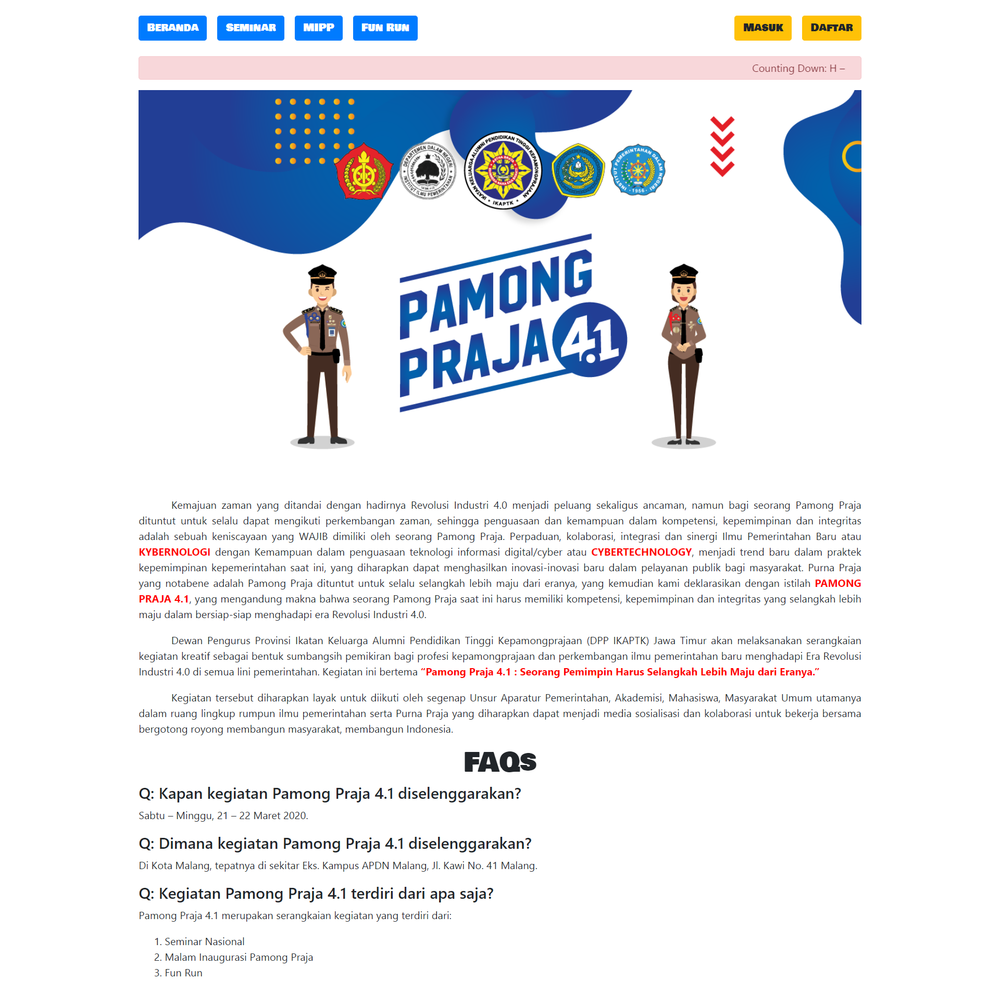
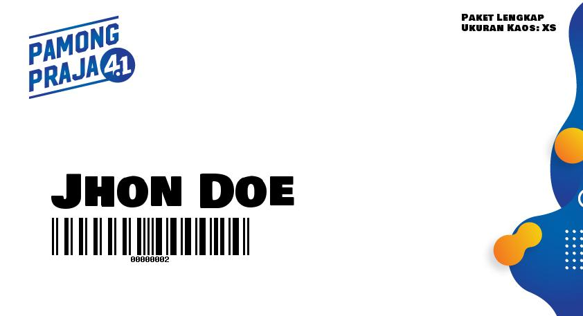
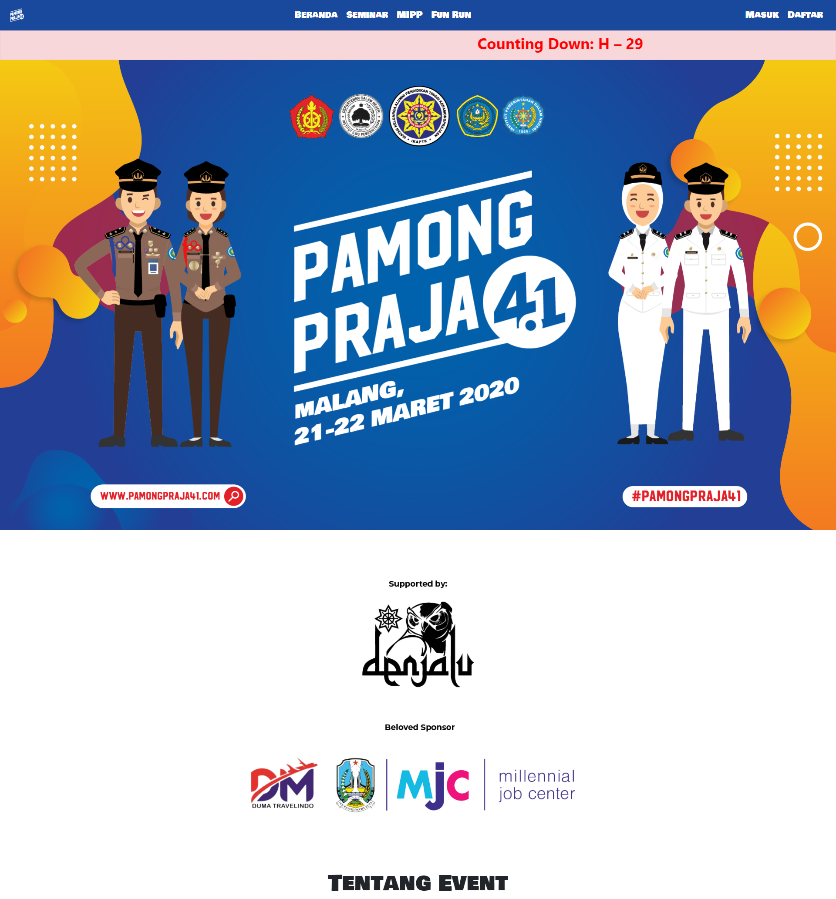

## Event Registration System

# Revisi 1

* Tambah FAQs

# Revisi 2

* Ubah tampilan sesuai [rev2.pdf](docs/rev2.pdf)

* Ubah desain tiket

# Revisi 3

* Ubah tampilan (iya, lagi)

# Revisi 4

* Tambah [surat kuasa](public/21.02.2020/surat_kuasa.pdf)

# Revisi 5

* Kirim tiket via Email
* Tambah [surat undangan](public/29.02.2020/surat_undangan.pdf)

# Revisi 6

* Tambah setting untuk matikan pilihan event registrasi

# Revisi 7

* Tambah opsi edit peserta

# Revisi 8

* Print Tiket Admin
* Tambah logo sponsor

# Revisi 9

* Tambah [PEMBATALAN DAN PENUNDAAN KEGIATAN PAMONG PRAJA 4.1 TAHUN 2020](public/16.03.2020/announcement.pdf)